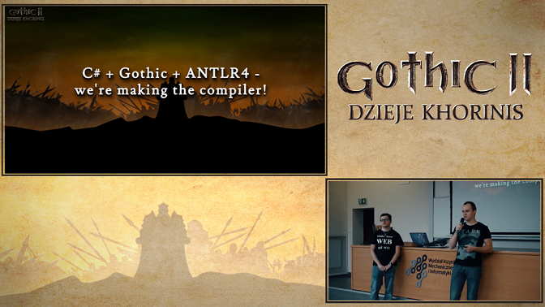

# Daedalus Compiler  [](https://github.com/dzieje-khorinis/DaedalusCompiler)
This is repo with Daedalus ( Gothic I, II scripting language ) compiler.
Project is using internally ANTL4 for parsing source code.
The compiler itself is written in .NET Core C#.

You can listen about our compiler on below video. Video has bad audio quality, we encourage you to turn on subtitles, on the current moment we have subtitles for Polish, German and English

[](http://www.youtube.com/watch?v=naPydcbJezw)
## Download
[Download](https://github.com/dzieje-khorinis/DaedalusCompiler/releases/latest) latest version of the tool
## Requirements
* Installed .NET Core 2+ runtime
## Standard Usage
* Unpack ZIP in place where you store programs ( ex. `C:/users/John/Documents` )
* Use compiler with dotnet runtime in bash/CMD ( ex. `dotnet C:/users/John/Documents/DaedalusCompiler/DaedalusCompiler.dll Gothic.src` )
* ( optional ) Make alias for compiler for easy usage, recommended name of alias will be `daedalus-compiler` (ex. in unix `alias daedalus-compiler="dotnet /Users/John/tools/DaedalusCompiler/DaedalusCompiler.dll"`)
## Usage with docker ( .NET Core runtime not needed )
Our compiler is available on docker hub, if you have installed docker you should be able to run compiler with:
```sh
docker run -v "$(pwd)":/usr/workspace dziejekhorinis/daedalus-compiler <path-to-gothic-src>
```
Path which is argument of docker run is relative to folder where we made mount.

Example usage:
```sh
docker run -v "$(pwd)":/usr/workspace dziejekhorinis/daedalus-compiler ./Gothic.src
```
## Configure development environment
Project uses ANTLR4 and .NET Core C#. 

For .NET Core C# it is recomended to use Visual Studio 2017.

For ANTLR4 you can use InteliJ or Visual Studio Code.

### Configure VSCode for ANTLR
1. Install Java (I think the best choice will be [Java8 SDK](http://www.oracle.com/technetwork/java/javase/downloads/jdk8-downloads-2133151.html)).
2. Install [ANTLR4 VSCode extension](https://marketplace.visualstudio.com/items?itemName=mike-lischke.vscode-antlr4).
3. Optionally you can install [Daedalus VSCode extension](https://marketplace.visualstudio.com/items?itemName=szymonzak.daedalus).

Now you can open folder `/DaedalusCompiler/src/Parser` in VSCode and start contributing Daedalus gramar. 

ANTLR 4 VSCode extension helps you developing gramar by syntax coloring, code completion and debugging tools. For more details check out [ANTLR 4 VSCode extension](https://marketplace.visualstudio.com/items?itemName=mike-lischke.vscode-antlr4) site.
