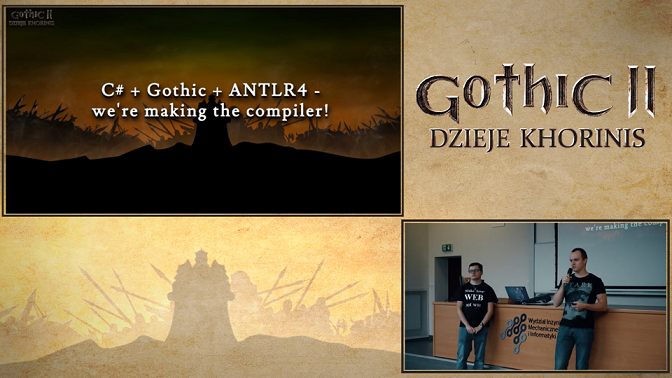

# Daedalus Compiler  [](https://github.com/dzieje-khorinis/DaedalusCompiler/actions/workflows/ci.yml) [](https://github.com/dzieje-khorinis/DaedalusCompiler/actions/workflows/release.yml)
This is repo with Daedalus ( Gothic I, II scripting language ) compiler.
Project is using internally ANTLR4 for parsing source code.
The compiler itself is written in .NET 8 C# with modern features like nullable reference types and single-file publishing.

You can listen about our compiler on below video. Video has bad audio quality, we encourage you to turn on subtitles, on the current moment we have subtitles for Polish, German and English language.

[](http://www.youtube.com/watch?v=naPydcbJezw)
## Download
[Download](https://github.com/dzieje-khorinis/DaedalusCompiler/releases/latest) latest version of the tool
## Requirements
* Installed .NET 8+ runtime

## Standard Usage
* Download & unpack [latest release](https://github.com/dzieje-khorinis/DaedalusCompiler/releases/latest).
* Use **dotnet** runtime to run the Compiler:
```
$ dotnet /path/to/DaedalusCompiler/DaedalusCompiler.dll
```
* Make alias for easy usage. Recommended alias is `gdc` (`g`othic `d`aedalus `c`ompiler). 

For example in Linux and MacOS type:
```
$ alias gdc='dotnet /path/to/DaedalusCompiler/DaedalusCompiler.dll'
```

#### Example usage:

* generate `Gothic.dat` file from `Gothic.src` file in output directory:
```
$ gdc /path/to/Gothic.src
```

* generate `result.dat` file from `Gothic.src` file in custom directory, using custom runtime:
```
$ gdc /path/to/Gothic.src --runtime /path/to/runtime.d --output-dat /path/to/result.dat
```

* generate `ou.csl`, `ou.bin` and `Gothic.dat` in output directory, ignore warnings W1 and W2:
```
$ gdc /path/to/Gothic.src --gen-ou --suppress W1:W2
```

* generate `Gothic.dat` in `Scripts/_compiled`, `ou.csl` and `ou.bin` in `Scripts/Content/Cutscene`:
```
$ gdc /path/to/Gothic.src --output-dat "Scripts/_compiled/Gothic.dat" --gen-ou --output-ou "Scripts/Content/Cutscene"
```

* generate `Gothic.dat`, enable unused symbol detection, provide zen paths to make that detection more accurate:
```
$ gdc /path/to/Gothic.src --zen-paths="/path/to/zens/*.zen" 
```

## Modern .NET 8 Features

This upgraded version includes several modern .NET 8 features:
* **Single-file deployment**: Publish as a single executable file
* **Nullable reference types**: Enhanced null safety and better IntelliSense
* **Improved performance**: Better startup time and runtime performance
* **ReadyToRun compilation**: Faster application startup

### Publishing as a single executable
```sh
dotnet publish -c Release -r win-x64 --self-contained
dotnet publish -c Release -r linux-x64 --self-contained
dotnet publish -c Release -r osx-x64 --self-contained
```

## Usage with docker ( .NET 8 runtime not needed )
Our compiler is available on docker hub, if you have installed docker you should be able to run compiler with:


```sh
docker run -v "$(pwd)":/usr/workspace dziejekhorinis/daedalus-compiler <path-to-gothic-src>
```
Path which is argument of docker run is relative to folder where we made mount.

#### Example usage:
```sh
docker run -v "$(pwd)":/usr/workspace dziejekhorinis/daedalus-compiler ./Gothic.src
```
## Configure development environment
Project uses ANTLR4 and .NET 8 C#. 

For .NET 8 C# it is recommended to use Visual Studio 2022 or later, or Visual Studio Code with the C# extension.

For ANTLR4 you can use InteliJ or Visual Studio Code.

### Configure VSCode for ANTLR
1. Install Java (I think the best choice will be [Java8 SDK](http://www.oracle.com/technetwork/java/javase/downloads/jdk8-downloads-2133151.html)).
2. Install [ANTLR4 VSCode extension](https://marketplace.visualstudio.com/items?itemName=mike-lischke.vscode-antlr4).
3. Optionally you can install [Daedalus VSCode extension](https://marketplace.visualstudio.com/items?itemName=szymonzak.daedalus).

Now you can open folder `/DaedalusCompiler/src/Parser` in VSCode and start contributing Daedalus gramar. 

ANTLR 4 VSCode extension helps you developing gramar by syntax coloring, code completion and debugging tools. For more details check out [ANTLR 4 VSCode extension](https://marketplace.visualstudio.com/items?itemName=mike-lischke.vscode-antlr4) site.
