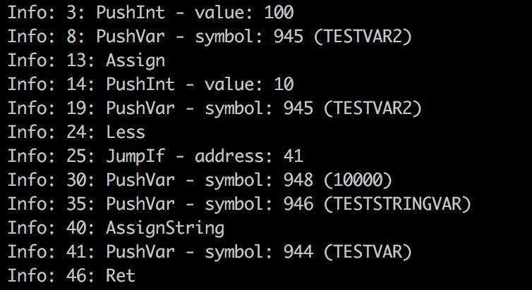

# Gothic VM & Daedalus Overview

This is overview of Gothic I & II VM which runs Daedalus scipts

## DAT format specyfication

If you want see code how DAT is loaded please analyze [this](https://github.com/ataulien/ZenLib/blob/76320437c8096b2d315c8b2f63eb9da4d86c4c79/zenload/DATFile.cpp#L71). So best would be reading that document with simultaneous looking on code to undestand all concepts ;)

### Data

#### How interpret numbers saved in DAT?

Let's assume we have saved somewhere number in DEC system on 2 bytes, for example:

```
0000 0101 0000 0001
```

In HEX it would be:

```
05 01
```

When we interpret that as a number we should get **261**( 05 => **5**, 01 => **256** ). So last byte is most significant.

Modern languages should properly load numbers with above representation.

#### Types

Data types which we will be using in article:

| Typ Name           | Size in bytes | Extra                                                                                                                                    |
| ------------------ | ------------- | ---------------------------------------------------------------------------------------------------------------------------------------- |
| DWord              | 4             |                                                                                                                                          |
| Word               | 2             |                                                                                                                                          |
| Byte               | 1             |                                                                                                                                          |
| Float              | 4             |                                                                                                                                          |
| String of N length | 1xN           | When parser load string he recognizes end of string when occur one of that signs: `\r`, `\n`, ` ` (space). Each byte represents one sign |

### Header of DAT

| Name                            | Start Address ( in bytes )       | Size ( in bytes ) | Remarks                                                                                                                                                             |
| ------------------------------- | -------------------------------- | ----------------- | ------------------------------------------------------------------------------------------------------------------------------------------------------------------- |
| Version                         | 0                                | 1                 | Version of DAT file. Not very useful information                                                                                                                    |
| Symbols Count ( SC - shortcut ) | 1                                | 4                 | Length of symbols which interpreter needs to load                                                                                                                   |
| Sort table                      | 5                                | SC * 4            | Some useless array with numbers ( TODO good will be make verify that )                                                                                              |
| Symbols                         | SC * 4 + 1                       | SC * Symbol Size  | Size of symbol is not fixed. For each symbol size is different, it depends for example from name of symbol                                                          |
| Code Stack Size                 | Symbols End Address + 1          | 4                 | Size of code stack in bytes                                                                                                                                         |
| Code Stack                      | Code Stack Size  End Address + 1 | Code Stack Size   | Size of single instruction depends from type of that instruction. For example instruction **RETURN** ( takes 0 args ) will be shorter then **JUMP** ( takes 1 arg ) |

#### Example:

TODO

### Symbol

TODO symbol overview

Each symbol have following structure:

| Name       | Start address (in bytes) | Size ( in bytes ) | Remarks                                                                                                                                                                                                                                                                                                                                                                                                                                                                                                                                                                                     |
| ---------- | ------------------------ | ----------------- | ------------------------------------------------------------------------------------------------------------------------------------------------------------------------------------------------------------------------------------------------------------------------------------------------------------------------------------------------------------------------------------------------------------------------------------------------------------------------------------------------------------------------------------------------------------------------------------------- |
| Has_name   | 0                        | 4                 | **if** `Has_name == 0` then `N = 0`, else nothing happens.                                                                                                                                                                                                                                                                                                                                                                                                                                                                                                                                  |
| Name       | 4                        | N (dynamic)       | Sequence of chars that ends with `\n` or `0` if `has_name == 0`.  Name of symbol, for example: `C_MISSION.RUNNING`, `C_ITEM`, `MAX_WISPSKILL`                                                                                                                                                                                                                                                                                                                                                                                                                                               |
| Properties | 4 + N + 1                | 28                | That field describes details of symbol. Most important thing is information of how many sub items have symbol ( needed for arrays ), what is type of symbol ( `void`, `float`, `int`, `string`, `class`, `func`, `prototype` or `instance` ) and what flags symbol have ( `const`, `return`, `classvar`, `external` )                                                                                                                                                                                                                                                                                                                                  |
| Content    | 4 + N + 1 + 28           | X (dynamic)       | If `Properties.type == float` then it is `float`s array of `length == Properties.count` (`X = Properties.count * 4`).<br>If `Properties.type == int` then it is `int`s array of `length == Properties.count` (`X = Properties.count * 4`).<br>If `Properties.type == string` then it is `string`s array of `length == Properties.count` (`X = Properties.count * individual_string_length`).<br>If `Properties.type == class` then it is `int` and means `class_offset` (`X = 4`).<br>If `Properties.type == func or prototype or instance` then it is `int` and means `address` (`X = 4`). |
| Parent     | 4 + N + 1 + X + 28       | 4                 | It is `index` in symbols array.<br> `instance`'s parent is its `prototype` / `class`.<br>`prototype`'s parent is its `class`.<br>If `var` was defined inside `class`, that `class` will be its parent.<br>If `func`'s 1st parameter is `instance` then all other parameters will have the same parent as that `instance`.<br>If parent `class` isn't written in Deadalus (internal) and for all other cases `parent = -1`.                                                                                                                                                                  |

#### Properties in details

Structure of properties is described very well by that code:

```c++
struct Properties
{
    int32_t  offClsRet;  // Offset (ClassVar) | Size (Class) | ReturnType (Func)
    struct {
        uint32_t count : 12; // Count:12, Type:4 (EParType_), Flags:6 (EParFlag_), Space: 1, Reserved:9
        uint32_t type  : 4; // EParType_*
        uint32_t flags : 6; // EParFlag_*
        uint32_t space: 1;
        uint32_t reserved : 9;
    }elemProps;

    struct
    {
        uint32_t value : 19;  // Value:19, Reserved:13
        uint32_t reserved : 13;
    }fileIndex;

    struct
    {
        uint32_t value : 19;  // Value:19, Reserved:13
        uint32_t reserved : 13;
    }lineStart;

    struct
    {
        uint32_t value : 19;  // Value:19, Reserved:13
        uint32_t reserved : 13;
    }lineCount;

    struct
    {
        uint32_t value : 24;  // Value:24, Reserved:8
        uint32_t reserved : 8;
    }charStart;

    struct
    {
        uint32_t value : 24;  // Value:24, Reserved:8
        uint32_t reserved : 8;
    }charCount;

} properties;
```

That code is part of ZenLib. Let me descibe that a little bit. If you don't know C++ you maybe wonder what means that `:` in each field of struct. Number after `:` tells how many bits should be stored in field. We need use that cause symbol description have not standard fields lengths. Most important field in that strucute are in `elemProps` sub structure. First field, `offClsRet`,  is information which means something different depending from symbol type, for class variable it would be offset of that symbol, for class it's size and for function returned type (**TODO** make sure if that really usless thing, ZenLib does't use that) . That information is useless. Next thing is sub items **count**, it is stored in 12 bits. As I mentioned above **count** property tells how many sub items field have, for example for `const int items[23]`**count** would be 23, for variables which are not array **count** would be 1. Next imporatnt field is `type`, it's flag which tells type of field, it could be one of:

| Name      | Flag value |
| --------- | ---------- |
| Void      | 0          |
| Float     | 1          |
| Int       | 2          |
| String    | 3          |
| Class     | 4          |
| Func      | 5          |
| Prototype | 6          |
| Instance  | 7          |

**flags** inform us about modyficator which is used on symbol, here we have possible values:

| Name     | Flag value |
| -------- | ---------- |
| Const    | 1          |
| Return   | 2          |
| ClassVar | 4          |
| External | 8          |
| Merged   | 16         |

Rest of fields in **Properties** struct is useless, names of that fields are pretty meaningfull. 

#### Example:

TODO

### Code Stack

## VM

Gothic VM is simlar to other VMs. It has instruction pointer, stack, instructions e.t.c. In that article we will focus on ZenLib VM which aim is to work similar to original Gothic VM.

Let's take a look first how looks like assembler stored in DAT file:



Instructions are similar to that one from classic x86 assembler. That numbers on the left from opcode are addresses with information where instruction is stored. If you look into **JumpIf** you should notice that argument address of jump is **41**, this is condition jump, when condition is equel  ( we will analyze later how VM check condition ) to **true** we make jump to `PushVar - symbol: 944...`. Maybe you wonder what means that number after `symbol:`, it's index of symbol, when we load symbols from DAT file their index is simply determined according to the order of reading, very simple. 

Let's take a look how works VM. To go through code we need pointer which tells where we are, it's called **program counter**, it's 32bit number( in ZenLib ). Counter is changing dynamically after traversing assembler code. Default behaviour of counter after executing instruction is to increment to next neighboring instruction. The exception is case when instruction is jump ( also call operation ) which I mentioned above.

Another important thing is **stack**. Technically it's vector of **int**. Instruction which begin from **push** prefix, appends stack with new values, later **pop** operations can use that values and make for example some calculcation. Stack could be also used to invoke some external functions which are implemeneted in engine, in that case we need **push** to stack right arguments, external function will **pop** that values and use them. In general stack is created for communication purposes.

### How works push ?

Into stack we can push different things. ZenLib is pushing for example ints, strings and variables. For each number of items which we push on stack is different, last item on stack should be opcode of operation, thanks that later if someone want to pop value from stack he will be know how interprete things from stack. 

#### Pushing int

Best illustration how works pushing will be fragment of ZenLib VM:

```c++
void DaedalusVM::pushInt(uint32_t value)
{
    m_Stack.push(value);
    m_Stack.push(EParOp_PushInt);
}
```

We push on stack 2 things, value and opcode of operation. Nothing to explain.

#### Pushing variable

Code:

```c++
void DaedalusVM::pushVar(size_t index, uint32_t arrIdx)
{
    m_Stack.push(arrIdx);
    m_Stack.push(static_cast<int32_t>(index));
    m_Stack.push(EParOp_PushVar);
}
```

In that case we push firstly index of variable. As I mentioned in chapter about loading symbols by design all variables are threated as a array, so something like that in daedalues: `var int test_var;`on the level of VM is treated as `var int test_var[1];`.

#### Pushing string ( literal )

That case is most interesting, I think you should study that case attentively to get know VM good. 

**Imporatnt thing to notice**, pushing string not happen when we want push into stack variable which store string, in that we will use **pushVar**. Pushing string happen when we use literal.

ZenLib create on initialization special extra symbols which are the same symbols which we load from DAT file, only difference is fact that their are created artificially by VM. Let's look on fragment of VM contructor:

```c++
class DaedalusVM
{
  ...
    std::queue<size_t> m_FakeStringSymbols;
  ...
};
...
const int NUM_FAKE_STRING_SYMBOLS = 5;
...
DaedalusVM::DaedalusVM(/ ... /)
{
    ...
    // Make fake-strings
    for(size_t i=0;i<NUM_FAKE_STRING_SYMBOLS;i++)
    {
        auto symIndex = m_DATFile.addSymbol(); // add new symbol ( under the hood we add that symbol to other symbols, after that VM can access that symbol like other loaded from DAT )
        // make sure there is enough space for 1 string
        m_DATFile.getSymbolByIndex(symIndex).strData.resize(1); // in practise it's prepare symbol to store string
        m_FakeStringSymbols.push(symIndex); // add symbol id to our fake string symbol id's
    }
        ...
}
```

As you see we have special field, **m_FakeStringSymbols**, where we store symbol id's for string literals. Let's take a look now on pushString function:

```c++
void DaedalusVM::pushString(const std::string& str)
{
    size_t symIdx = m_FakeStringSymbols.front();
    Daedalus::PARSymbol& s = m_DATFile.getSymbolByIndex(symIdx);
    m_FakeStringSymbols.push(m_FakeStringSymbols.front());
    m_FakeStringSymbols.pop();

    s.getString(0) = str;

    pushVar(symIdx, 0);
}
```

First instruction takes id of symbol which we will be using for storing string literal. Next we look for that symbol by querying in all symbols ( so we access now that artificially symbols created by VM on initialization  ). Next we refresh **m_FakeStringSymbols**, so on back of queue we have lastly pushed string, on front oldest. Oldest pushed string in queue is losted when we push new value. Let's look into next instruction:  **s.getString(0)**, it returns pointer ( I don't want to go into implementation details how that pointer receiver works, it's not necessary at that point ) into place where we will store string of symbol. Lastly we invoke **pushVar** which I described above. Important thing to notice is fact that **pushString** method does't use directly stack, it's only prepare symbol where literal will be stored and next we push index of that symbol into stack with **pushVar**.

### How works pop ?

Now when we know how works pushing we should't have problems with **pop**. Thanks pop operation we can access eariler pushed values.

#### Pop variable

Let's check how it's coded:

```c++
template <typename T>
T DaedalusVM::popDataValue()
{
    // Default behavior of the ZenGin is to pop a 0, if nothing is on the stack.
    if(m_Stack.empty())
        return static_cast<T>(0);

    uint32_t tok = m_Stack.top();
    m_Stack.pop(); // Pop token

    uint32_t v = m_Stack.top();
    m_Stack.pop(); // Pop value


    uint32_t arrIdx = 0;
    switch(tok)
    {

        case EParOp_PushInt:
            return reinterpret_cast<T&>(v); // reinterpret as float for T=float

        case EParOp_PushVar:
            arrIdx = m_Stack.top();
            m_Stack.pop(); // Pop array index
            return m_DATFile.getSymbolByIndex(v).getValue<T>(arrIdx, getCurrentInstanceDataPtr());

        default:
            return static_cast<T>(0);
    }

}
```

Firstly we need **pop** 2 values, first one is opcode of operation which we pushed, second one it's pushed **int** value or index of symbol, it depends from opcode, in switch we split that 2 cases.  If you look into code all should be clear, since I made detailed description of **push**, pop is reverse action. 

One thing which can be strange for you is invoking `getCurrentInstanceDataPtr`, that function return pointer to instance, in case where we **pop** value which is not member of instance that function return null, later we will tell more about instances.

#### Pop string

Code of operation:

```c++
std::string DaedalusVM::popString(bool toUpper)
{
    uint32_t arr;
    uint32_t idx = popVar(arr);

    std::string s = m_DATFile.getSymbolByIndex(idx).getString(arr, getCurrentInstanceDataPtr());

    if(toUpper)
        std::transform(s.begin(), s.end(), s.begin(), ::toupper);

    return s;
}
```

In fact **popString** fristly make **popVar** ( that method works the same like **popDataValue** but in case where someone pushed variable, it returns index of symbol instead value which is in that symbol  ) to get symbol index, after that we access value from that symbol and return string.

#### Pop float

```c++
float DaedalusVM::popFloatValue()
{
    return popDataValue<float>();
}
```

Nothing to comment, we make additionaly only projection to float.

### How looks like runtime?

To perform operation on VM, ZenLib created function called `doStack`, let's take a look declaration:

```
/**
* @brief Performs a single instruction on the stack
* @return True, if the program should continue, false if the end was reached
*/
bool doStack(bool verbose = false);
```

Description above the function is good. Only exception is when operation which is made is calling other function, in that case we exec fully that called function.

Let's take a look into skeleton of that function:

```c++
bool DaedalusVM::doStack(bool verbose)
{
    static bool log = verbose;
    size_t oldPC = m_PC;
    PARStackOpCode op = getCurrentInstruction();

    int32_t a;
    int32_t b;
    uint32_t arr, arr2;
    int32_t* addr;
    std::string* straddr, *straddr2;
    static PARSymbol s;
    PARSymbol& sym = s;
    PARSymbol& sym2 = s;

    if(log) LogInfo() << oldPC << ": " << OP_MAP[op.op];

    switch(op.op)
    {
				...
          // different operations which depend from opcode of current instruction
        ...
    }

    return true;
}
```

On the top of definition we have some helper variables, most important is operation of getting opcode, `getCurrentInstruction`, let's check code of that:

```c++
PARStackOpCode DaedalusVM::getCurrentInstruction()
{
    PARStackOpCode op = m_DATFile.getStackOpCode(m_PC);
    m_PC += op.opSize;

    return op;
}
```

Firstly we need get know more about operation which is currently pointed by program counter, to get that info we need invoke `getStackOpCode` method which works on loaded DAT file. `PARStackOpCode`is simple structure which include opcode, additionaly if operation makes jump it have address of that jump place, if operation push variable to stack it have symbol index, if operation push **int** to stak it have literal value.

Next we increment program counter to point in next instruction.

On the end we return created instruction object.


Going back to `doStack` method we should notice **switch** statement, it's most  interesting place, here depending from instuction type we make operation on stack, call external function e.t.c.

### Basic operations ( add, divide, less, greater, e.t.c )

todo

### Assigment operation

todo

### Operation with jumps

todo

## Tips


